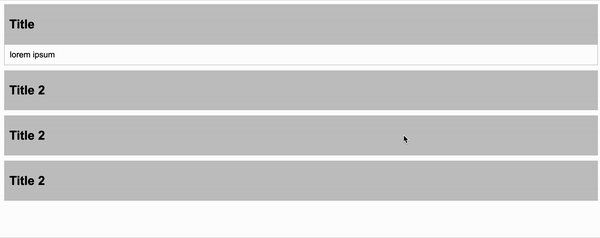

# Accordion

Simple accordion to demonstrate adding and removing, so-called "toggling" css `class` to achieve display and
hiding certain sections in the FAQ.

## Files

> ℹ️ You can always find a better solution, this is the solution created in the classroom at that moment. So it may not
> be
> the most optimal.

- Acordion minimal `CSS` [accordion.css](accordion.css)
- Acordion minimal `JS` [accordion.js](accordion.js)
- Acordion minimal `HTML` [index.html](index.html)

## How it works

It traverses each element on the HTML page with the `.accordion` class and inside each selected element it traverses
elements with `.item` in the same way and sets the click event on these elements and then uses the `.active` css class
toggle to add or remove it to the currently clicked `.item`